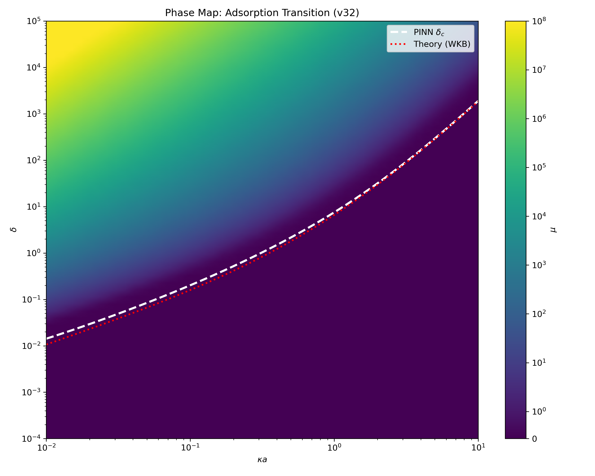
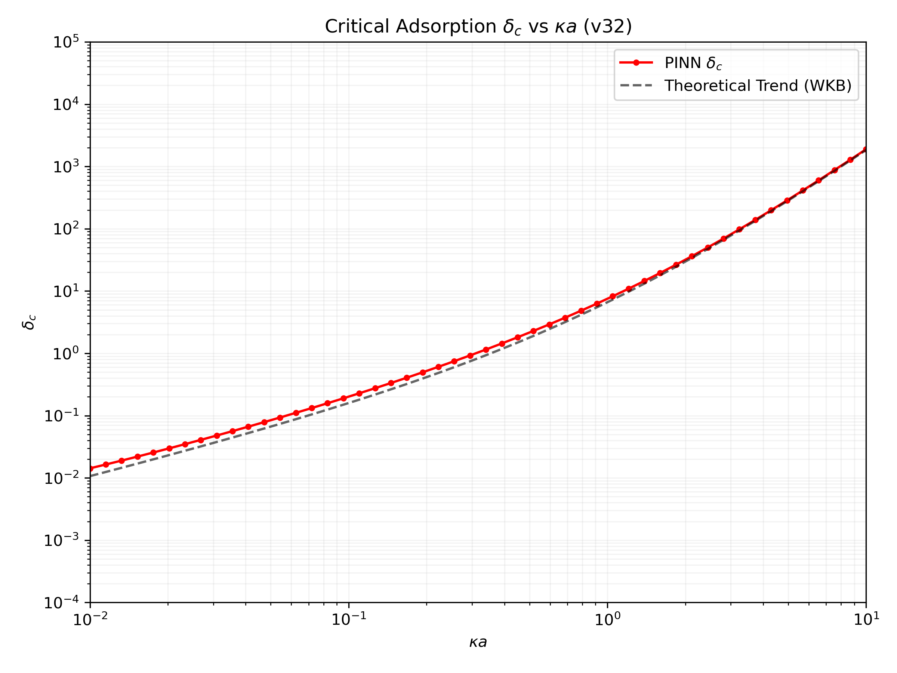
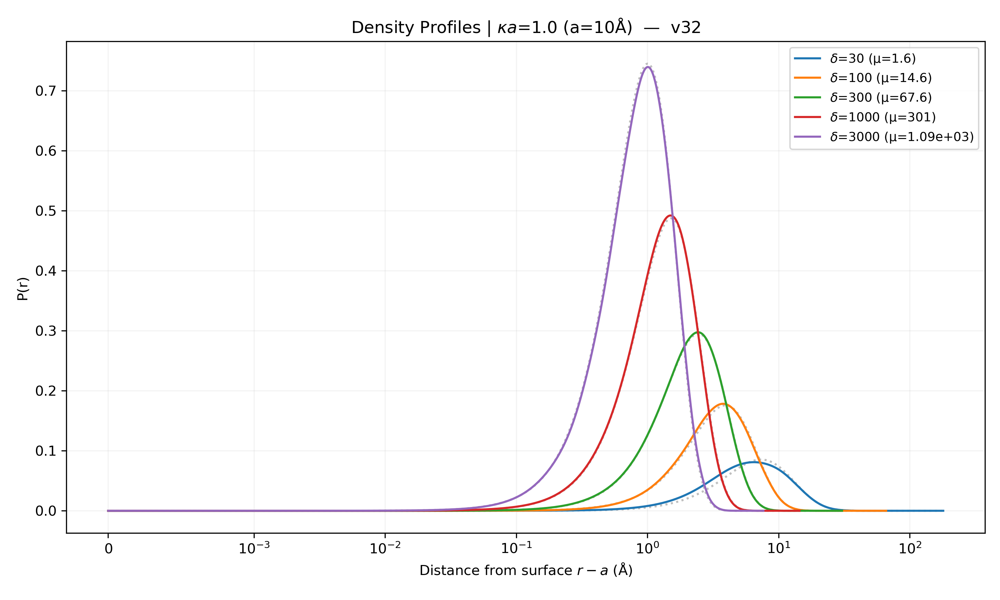

<div align="center">

# PINN-s — Adsorção de Polímeros por Redes Neurais Informadas por Física

**Onde uma cadeia polimérica gruda numa nanopartícula carregada, e onde ela solta.**

*Read this in other languages: [Português](#o-problema-em-uma-frase) · [English](#the-problem-in-one-sentence)*

</div>

---

## O problema em uma frase

Uma cadeia de polímero carregado, numa solução salgada, perto de uma esfera com carga oposta:
**ela adere à superfície ou continua solta no líquido?** Este repositório resolve essa pergunta
para todas as combinações de carga e salinidade de uma vez, com uma rede neural treinada não
para imitar dados, mas para satisfazer a equação diferencial do problema.

<div align="center">
  
</div>

Essa é a resposta completa numa figura só. Cada ponto do plano é uma condição experimental
diferente; a cor é a **energia de ligação** da cadeia à esfera. Em cima e à esquerda ela está
grudada com força; embaixo à direita, solta. A linha tracejada branca é a fronteira entre os
dois regimes, calculada pela rede — e a pontilhada vermelha é a fórmula clássica com que
comparamos.

---

## Traduzindo os eixos

Três grandezas bastam para entender tudo o que vem a seguir.

| símbolo | o que é | em palavras |
|---|---|---|
| $\delta$ | parâmetro de adsorção | **o quanto a superfície puxa.** Cresce com a carga da esfera e cai com o sal, que faz blindagem |
| $\kappa a$ | raio em unidades de blindagem | **o tamanho aparente da esfera.** Pequeno = bolinha muito curva; grande = a cadeia enxerga quase uma parede plana |
| $\mu$ | autovalor | **a energia de ligação por monômero.** Positivo, a cadeia está adsorvida; tendendo a zero, ela se solta |

E a grandeza que dá nome a tudo:

> $\delta_c$ é o **ponto de virada** — o valor de $\delta$ em que a cadeia deixa de aderir.
> Para cada tamanho de esfera existe um $\delta_c$ diferente, e a curva $\delta_c(\kappa a)$ é o
> resultado central deste trabalho.

---

## Por que uma rede neural, e não só a fórmula?

Existe uma fórmula fechada para $\delta_c$ na literatura, obtida pela **aproximação WKB**
(semiclássica). Ela é elegante, cabe numa linha e é o instrumento certo para extrair leis de
escala. Mas ela tem uma fragilidade estrutural **exatamente no ponto que interessa**.

A aproximação WKB supõe que o potencial varia devagar comparado ao comprimento de onda local da
solução. No limiar de adsorção, por definição, a energia de ligação vai a zero — e quando isso
acontece, a cadeia se espalha indefinidamente para longe da superfície. O comprimento de onda
local diverge. A hipótese quebra justamente onde $\delta_c$ é definido.

O artigo original diz isso com todas as letras: o método *"naturally fails in the proximity of
the zero-potential point"*, e $\delta_c$ é obtido levando esse ponto ao infinito.

**A rede aqui não é um modelo estatístico.** Ela não foi treinada em dados experimentais. Ela é
um **ansatz variacional** — uma função tentativa com parâmetros livres, ajustados para anular o
resíduo da própria equação diferencial. É a mesma estrutura lógica do método de Rayleigh-Ritz,
usado em mecânica quântica desde os anos 1920; a diferença é que a base é adaptativa em vez de
fixa. E ela não supõe nada sobre a razão entre o potencial e o comprimento de onda, então não
sofre a degradação da WKB perto do limiar.

---

## O resultado: $\delta_c$ contra $\kappa a$

<div align="center">
  
</div>

As duas curvas concordam bem para esferas grandes (direita) e se separam progressivamente
conforme a esfera fica mais curva (esquerda) — que é precisamente a região que o artigo original
aponta como sua contribuição, e para a qual não havia solução exata de comparação.

### Quem está mais perto da verdade?

Para responder isso é preciso uma referência independente das duas. Usamos a **diagonalização
direta** do operador: o espaço é discretizado, a matriz resultante é tridiagonal, e o menor
autovalor sai exato de uma rotina do LAPACK. O único erro é o da discretização, controlado por
300 mil pontos e um domínio que se adapta ao alargamento da solução.

Os três métodos usam **exatamente o mesmo critério** de limiar e o mesmo procedimento de busca:

| $\kappa a$ | referência numérica | PINN | WKB | PINN / ref | **WKB / ref** |
|---|---|---|---|---|---|
| 0,01 | 0,017553 | 0,01425 | 0,010673 | 0,812 | **0,608** |
| 0,03 | 0,055665 | 0,04629 | 0,036443 | 0,832 | **0,655** |
| 0,10 | 0,21913 | 0,2015 | 0,15919 | 0,920 | **0,726** |
| 0,30 | 0,95213 | 0,9512 | 0,76617 | 0,999 | **0,805** |
| 1,00 | 7,4687 | 7,516 | 6,6064 | 1,006 | **0,885** |
| 3,00 | 83,574 | 81,43 | 77,907 | 0,974 | **0,932** |
| 10,0 | 1933,1 | 1892 | 1842,4 | 0,979 | **0,953** |

| método | desvio médio | desvio máximo |
|---|---|---|
| **PINN** | **7,0 %** | 18,8 % |
| WKB | 20,5 % | 39,2 % |

Repare na estrutura do erro da WKB: a razão sobe monotonicamente de 0,61 até 0,95 conforme
$\kappa a$ cresce. Ou seja, a aproximação é ótima no limite plano — onde o artigo a validou a
1,8 % — e se degrada progressivamente à medida que a curvatura aumenta. E ela **subestima
$\delta_c$ em todos os sete pontos**, nunca superestima.

---

## O que cada método pode e não pode fazer

Isto não é uma disputa: os três resolvem a mesma equação e servem a propósitos diferentes.

| | diagonalização | WKB | **PINN** |
|---|---|---|---|
| dá uma fórmula fechada, manipulável algebricamente | não | **sim** | não |
| tem erro estimável antes de calcular | discretização | **sim** | não |
| continua válida no limiar, com $\mu \to 0$ | sim | **não** | sim |
| custo de um ponto novo | uma diagonalização | trivial | milissegundos |
| entrega $\mu(\delta, \kappa a)$ como **superfície contínua** | não, ponto a ponto | não, só a fronteira | **sim** |
| permite $\partial\mu/\partial\delta$ e $\partial^2\mu/\partial\delta^2$ por diferenciação automática | não | não | **sim** |

**A última linha é o ganho real**, e é o que motiva o método — a precisão superior à WKB é uma
consequência favorável, não a justificativa. Um solver numérico devolve um número por condição e
precisa ser repetido ponto a ponto; dele não se extrai uma derivada. A rede devolve uma função
suave de todo o plano de parâmetros, e as derivadas saem de graça por `torch.autograd`. É isso
que permite construir mapas de **suscetibilidade termodinâmica** — o quanto o sistema responde a
uma variação de carga — que nenhum dos outros dois métodos entrega diretamente.

---

## Os perfis de densidade

<div align="center">
  
</div>

Onde o polímero fica, em função da distância à superfície, para cinco intensidades de atração.
As linhas contínuas são a previsão da rede; as pontilhadas cinzas, a referência numérica. Quanto
mais forte a atração, mais fino e mais alto o pico — a cadeia se comprime contra a superfície.

Esta figura usa $\kappa a = 1$ e $a = 10\ \text{Å}$, os mesmos parâmetros da Fig. 6 do artigo de
referência, de propósito: é sobreposição direta.

---

## Como sabemos que a referência é confiável

Uma referência que ninguém aferiu não serve de referência. O caso da **superfície plana** permite
aferir, porque ali existe solução analítica exata: $\delta_c/(\kappa a)^3 = j_{0,1}^2/4 = 1{,}4458$,
onde $j_{0,1}$ é o primeiro zero da função de Bessel $J_0$.

Aplicando o mesmo maquinário numérico usado na esfera:

| método | valor obtido | erro contra o exato |
|---|---|---|
| **nossa referência numérica** | 1,44866 | **0,198 %** |
| WKB | — | 1,8 % |

A referência reproduz o resultado exato com erro quatro vezes menor que a própria WKB no mesmo
caso. É essa concordância que autoriza tratá-la como padrão na geometria esférica, onde não há
solução fechada.

### Uma controvérsia da literatura que os números ajudam a arbitrar

Há duas previsões incompatíveis para como $\delta_c$ escala com esferas muito pequenas:
proporcional a $\kappa a$ (Cherstvy & Winkler, via WKB) ou a $(\kappa a)^2$ (Muthukumar, via
método variacional). Ajustando a inclinação em escala log-log no intervalo $\kappa a \in [0{,}01;\ 0{,}03]$,
o expoente medido é **1,05** — o que apoia a primeira previsão.

---

## O modelo

A rede tem dois ramos, porque as duas grandezas de interesse têm naturezas diferentes:

- **`mu_net`** recebe só os parâmetros físicos $(\delta, \kappa a)$ e devolve $\log_{10}\mu$. A
  energia de ligação é uma propriedade global do sistema — isolá-la evita que ruído espacial
  contamine a previsão.
- **`phi_net`** recebe também a coordenada radial e devolve a forma do perfil de densidade.

O treino minimiza três coisas ao mesmo tempo: o resíduo da equação de Edwards em pontos de
colocação espalhados pelo domínio, a diferença contra 58 soluções exatas de ancoragem, e o
vínculo de normalização. Otimização em dois estágios: Adam para explorar, L-BFGS para polir.

| | |
|---|---|
| parâmetros ajustáveis | 626.690 |
| soluções exatas de ancoragem | 58, numa grade 10×10 em $(\kappa a, \delta)$ |
| pontos de colocação | 1.500 por passo |
| validação | 169 pontos independentes, nenhum usado no ajuste |
| treino | ~1 h 40 numa RTX 3050 6 GB |

### A mudança que fez a v32 funcionar

A versão anterior acertava a energia de ligação, mas **o perfil de densidade colapsava para zero**
sempre que a ligação era muito forte. O motivo: o estado ligado profundo é estreito, de largura
$\sim 1/\sqrt{\mu}$, e o envelope funcional da rede tinha taxa de decaimento limitada — cerca de
500 vezes larga demais nos casos extremos. As soluções de ancoragem, resolvidas num domínio fixo,
viravam vetores de quase-zeros, e o mínimo mais barato para a rede era prever zero em todo lugar.

A correção foi trocar a coordenada de entrada por $s = \sqrt{\mu}\,(u - \kappa a)$ e fatorar a
amplitude como $\mu^{1/4}$. Com isso, toda a dependência de escala — cinco décadas de largura e
duas de amplitude — passa a ser **analítica**, e a rede só precisa aprender uma forma de ordem 1.

| métrica | v31 | **v32** |
|---|---|---|
| $\mu$ — erro relativo mediano | 4,07 % | **0,61 %** |
| $\mu$ — $R^2$ em $\log_{10}$ | 0,98802 | **0,99979** |
| $\phi$ — erro L2 mediano | 18,0 % | **1,5 %** |
| $\phi$ — erro para $\mu > 10^4$ | 100 % (colapso) | **0,7–2,3 %** |

---

## Limitações

Um texto que só enumera vantagens convida à desconfiança. As que valem constar:

- **Perto do limiar o perfil ainda erra ~30 %.** Ali a solução se estende além do domínio
  truncado, e o vínculo de normalização deixa de capturar a cauda. É limitação do domínio, não
  da parametrização.
- **A precisão só é conhecida onde foi medida** — os 169 pontos da validação. Fora deles há
  expectativa de continuidade, não garantia.
- **O método depende do solver exato.** Foram 58 soluções por diagonalização para treinar e 169
  para validar. A rede não substitui o método numérico: apoia-se nele.
- **$\delta_c$ da v32 é sistematicamente 10–20 % baixo** em relação à referência. Consistente,
  mas enviesado.
- **A WKB continua sendo o instrumento certo** para extrair leis de escala assintóticas em forma
  fechada. Nada aqui muda isso.

---

## Reprodução

```bash
pip install torch numpy scipy matplotlib
cd scripts

# treino completo do zero (~1h40 numa RTX 3050 6GB)
python unified_pinn_edwards_v32.py
```

O script grava as figuras e os pesos **no diretório de onde é chamado** — daí o `cd scripts`.
Saídas: `phase_map_v32.png`, `critical_adsorption_v32.png`, `hf_pinn_ka_{0.1,1.0,5.0}_v32.png`,
`training_loss_v32.png`, `training_history_v32.json` e `unified_pinn_v32_model.pt`.

Duas opções que encurtam o caminho:

```bash
# aproveita a mu_net já treinada do v31, se o arquivo estiver presente
python unified_pinn_edwards_v32.py --init-from unified_pinn_v31_model.pt

# só refaz figuras e validação, sem treinar
# (exige unified_pinn_v32_model.pt no diretório corrente)
python unified_pinn_edwards_v32.py --epochs 1
```

O `--init-from` é opcional: se o arquivo não existir, o script simplesmente treina do zero.
Os pesos não estão versionados aqui por padrão — veja o `.gitignore`.

> **Sobre o gráfico de loss.** A curva cai de $3\cdot10^4$ para ~1 nas primeiras mil épocas e
> depois oscila numa faixa larga. Isso **não é instabilidade**: cada época sorteia 8 das 58
> âncoras, então o valor impresso depende do sorteio. O que importa é o piso das componentes —
> o resíduo da equação e o vínculo de normalização chegam a $10^{-3}$.

---

## Estrutura

```
scripts/
  unified_pinn_edwards_v32.py   modelo atual: rede, física, treino e validação
  unified_pinn_edwards_v31.py   versão anterior, mantida para comparação
  plot_phase_map_v31.py         varredura do domínio paramétrico
images/
  phase_map_v32.png             energia de ligação no plano (δ, κa)
  critical_adsorption_v32.png   curva crítica δ_c: rede contra WKB
  hf_pinn_ka_1.0_v32.png        perfis de densidade contra a referência
  training_loss_v32.png         evolução da loss
```

---

## Referência

A. G. Cherstvy e R. G. Winkler, *Polyelectrolyte adsorption onto oppositely charged interfaces:
unified approach for plane, cylinder, and sphere*, **Phys. Chem. Chem. Phys. 13**, 11686–11693
(2011). [DOI: 10.1039/c1cp20749k](https://doi.org/10.1039/c1cp20749k)

## Situação acadêmica

Primeira etapa de um projeto de mestrado em andamento. Os resultados aqui são **preliminares e
ainda não foram submetidos a banca de qualificação ou defesa**. O código e as figuras são
publicados para que a física possa ser conferida e discutida.

---

<div align="center">

# 🇺🇸 English Version

</div>

## The problem in one sentence

A charged polymer chain in a salty solution, near an oppositely charged sphere: **does it stick
to the surface, or stay free in the liquid?** This repository answers that for every combination
of charge and salinity at once, using a neural network trained not to imitate data, but to
satisfy the governing differential equation.

<div align="center">
  
</div>

That is the complete answer in one figure. Every point of the plane is a different experimental
condition; color is the chain's **binding energy** to the sphere. Top-left it is firmly bound;
bottom-right it is free. The dashed white line is the boundary between the two regimes as computed
by the network — the dotted red line is the classical formula we compare against.

---

## Translating the axes

Three quantities carry everything that follows.

| symbol | what it is | in words |
|---|---|---|
| $\delta$ | adsorption parameter | **how hard the surface pulls.** Grows with sphere charge, falls with salt, which screens it |
| $\kappa a$ | radius in screening units | **the sphere's apparent size.** Small = tightly curved bead; large = the chain effectively sees a flat wall |
| $\mu$ | eigenvalue | **binding energy per monomer.** Positive, the chain is adsorbed; approaching zero, it lets go |

And the quantity that names everything:

> $\delta_c$ is the **tipping point** — the value of $\delta$ at which the chain stops adhering.
> Each sphere size has its own $\delta_c$, and the curve $\delta_c(\kappa a)$ is this work's
> central result.

---

## Why a neural network, and not just the formula?

A closed-form expression for $\delta_c$ exists in the literature, derived from the **WKB
(semiclassical) approximation**. It is elegant, fits on one line, and is the right instrument for
extracting scaling laws. But it has a structural weakness **exactly where it matters**.

WKB assumes the potential varies slowly compared to the solution's local wavelength. At the
adsorption threshold, by definition, the binding energy goes to zero — and when that happens the
chain spreads out indefinitely away from the surface. The local wavelength diverges. The
assumption fails precisely where $\delta_c$ is defined.

The original paper says so explicitly: the method *"naturally fails in the proximity of the
zero-potential point"*, and $\delta_c$ is obtained by taking that point to infinity.

**The network here is not a statistical model.** It was not trained on experimental data. It is a
**variational ansatz** — a trial function with free parameters, tuned to null the residual of the
differential equation itself. This is the logical structure of the Rayleigh-Ritz method, used in
quantum mechanics since the 1920s; the difference is an adaptive rather than fixed basis. It
assumes nothing about the ratio between potential and wavelength, so it does not suffer WKB's
degradation near the threshold.

---

## The result: $\delta_c$ versus $\kappa a$

<div align="center">
  
</div>

The two curves agree well for large spheres (right) and separate progressively as curvature
increases (left) — precisely the region the original paper highlights as its contribution, and
for which no exact benchmark was available.

### Which one is closer to the truth?

Answering that requires a reference independent of both. We use **direct diagonalization**: space
is discretized, the resulting matrix is tridiagonal, and its lowest eigenvalue comes out exactly
from a LAPACK routine. The only error is discretization, controlled by 300,000 points and a
domain that adapts to the solution's spreading.

All three methods use **exactly the same** threshold criterion and search procedure:

| $\kappa a$ | numerical reference | PINN | WKB | PINN / ref | **WKB / ref** |
|---|---|---|---|---|---|
| 0.01 | 0.017553 | 0.01425 | 0.010673 | 0.812 | **0.608** |
| 0.03 | 0.055665 | 0.04629 | 0.036443 | 0.832 | **0.655** |
| 0.10 | 0.21913 | 0.2015 | 0.15919 | 0.920 | **0.726** |
| 0.30 | 0.95213 | 0.9512 | 0.76617 | 0.999 | **0.805** |
| 1.00 | 7.4687 | 7.516 | 6.6064 | 1.006 | **0.885** |
| 3.00 | 83.574 | 81.43 | 77.907 | 0.974 | **0.932** |
| 10.0 | 1933.1 | 1892 | 1842.4 | 0.979 | **0.953** |

| method | mean deviation | max deviation |
|---|---|---|
| **PINN** | **7.0 %** | 18.8 % |
| WKB | 20.5 % | 39.2 % |

Note the structure of WKB's error: the ratio climbs monotonically from 0.61 to 0.95 as $\kappa a$
grows. The approximation is excellent in the flat limit — where the paper validated it to 1.8 % —
and degrades progressively as curvature increases. And it **underestimates $\delta_c$ at all seven
points**, never overestimates.

---

## What each method can and cannot do

This is not a contest: all three solve the same equation and serve different purposes.

| | diagonalization | WKB | **PINN** |
|---|---|---|---|
| gives a closed form you can manipulate algebraically | no | **yes** | no |
| has an error bound known before computing | discretization | **yes** | no |
| remains valid at the threshold, $\mu \to 0$ | yes | **no** | yes |
| cost of one new point | a diagonalization | trivial | milliseconds |
| delivers $\mu(\delta, \kappa a)$ as a **continuous surface** | no, point by point | no, boundary only | **yes** |
| allows $\partial\mu/\partial\delta$ and $\partial^2\mu/\partial\delta^2$ by automatic differentiation | no | no | **yes** |

**The last row is the real gain**, and it is what motivates the method — beating WKB on accuracy
is a favorable consequence, not the justification. A numerical solver returns one number per
condition and must be repeated point by point; no derivative can be extracted from it. The network
returns a smooth function of the whole parameter plane, with derivatives free via `torch.autograd`.
That is what enables maps of **thermodynamic susceptibility** — how strongly the system responds
to a change in charge — which neither of the other two methods delivers directly.

---

## Density profiles

<div align="center">
  
</div>

Where the polymer sits as a function of distance from the surface, for five attraction strengths.
Solid lines are the network's prediction; dotted grey is the numerical reference. The stronger the
attraction, the narrower and taller the peak — the chain compresses against the surface.

This figure uses $\kappa a = 1$ and $a = 10\ \text{Å}$, the same parameters as Fig. 6 of the
reference paper, deliberately: it is a direct overlay.

---

## How we know the reference is trustworthy

An unvetted reference is no reference. The **flat surface** case allows vetting, because there an
exact analytical solution exists: $\delta_c/(\kappa a)^3 = j_{0,1}^2/4 = 1.4458$, where $j_{0,1}$
is the first zero of the Bessel function $J_0$.

Applying the same numerical machinery used for the sphere:

| method | value obtained | error vs exact |
|---|---|---|
| **our numerical reference** | 1.44866 | **0.198 %** |
| WKB | — | 1.8 % |

The reference reproduces the exact result with four times less error than WKB itself in the same
case. That agreement is what licenses treating it as the standard in spherical geometry, where no
closed-form solution exists.

### A literature controversy the numbers help arbitrate

There are two incompatible predictions for how $\delta_c$ scales for very small spheres:
proportional to $\kappa a$ (Cherstvy & Winkler, via WKB) or to $(\kappa a)^2$ (Muthukumar, via a
variational method). Fitting the log-log slope over $\kappa a \in [0.01,\ 0.03]$, the measured
exponent is **1.05** — supporting the first.

---

## The model

The network has two branches, because the two quantities of interest are different in nature:

- **`mu_net`** takes only the physical parameters $(\delta, \kappa a)$ and returns $\log_{10}\mu$.
  Binding energy is a global property of the system — isolating it keeps spatial noise out of the
  prediction.
- **`phi_net`** additionally takes the radial coordinate and returns the density profile's shape.

Training minimizes three things at once: the Edwards equation residual at collocation points
spread through the domain, the difference against 58 exact anchor solutions, and the normalization
constraint. Two-stage optimization: Adam to explore, L-BFGS to polish.

| | |
|---|---|
| trainable parameters | 626,690 |
| exact anchor solutions | 58, on a 10×10 grid in $(\kappa a, \delta)$ |
| collocation points | 1,500 per step |
| validation | 169 independent points, none used in fitting |
| training | ~1 h 40 min on an RTX 3050 6 GB |

### The change that made v32 work

The previous version got the binding energy right, but **the density profile collapsed to zero**
whenever binding was very strong. The reason: a deep bound state is narrow, of width
$\sim 1/\sqrt{\mu}$, and the network's functional envelope had a capped decay rate — roughly 500
times too wide in extreme cases. Anchor solutions, solved on a fixed domain, became vectors of
near-zeros, and the cheapest minimum for the network was to predict zero everywhere.

The fix was to change the input coordinate to $s = \sqrt{\mu}\,(u - \kappa a)$ and factor the
amplitude as $\mu^{1/4}$. With that, all scale dependence — five decades of width and two of
amplitude — becomes **analytical**, and the network only has to learn an order-one shape.

| metric | v31 | **v32** |
|---|---|---|
| $\mu$ — median relative error | 4.07 % | **0.61 %** |
| $\mu$ — $R^2$ in $\log_{10}$ | 0.98802 | **0.99979** |
| $\phi$ — median L2 error | 18.0 % | **1.5 %** |
| $\phi$ — error for $\mu > 10^4$ | 100 % (collapse) | **0.7–2.3 %** |

---

## Limitations

A text that lists only advantages invites suspicion. The ones worth stating:

- **Near the threshold the profile still errs by ~30 %.** There the solution extends beyond the
  truncated domain and the normalization constraint stops capturing the tail. A domain limitation,
  not a parametrization one.
- **Accuracy is known only where it was measured** — the 169 validation points. Outside them
  there is an expectation of continuity, not a guarantee.
- **The method depends on the exact solver.** 58 diagonalized solutions to train and 169 to
  validate. The network does not replace the numerical method: it leans on it.
- **v32's $\delta_c$ runs systematically 10–20 % low** against the reference. Consistent, but
  biased.
- **WKB remains the right instrument** for extracting closed-form asymptotic scaling laws. Nothing
  here changes that.

---

## Reproduction

```bash
pip install torch numpy scipy matplotlib
cd scripts

# full training from scratch (~1h40 on an RTX 3050 6GB)
python unified_pinn_edwards_v32.py
```

The script writes figures and weights **into the directory it is called from** — hence the
`cd scripts`. Outputs: `phase_map_v32.png`, `critical_adsorption_v32.png`,
`hf_pinn_ka_{0.1,1.0,5.0}_v32.png`, `training_loss_v32.png`, `training_history_v32.json` and
`unified_pinn_v32_model.pt`.

Two shortcuts:

```bash
# reuse the already-trained mu_net from v31, if the file is present
python unified_pinn_edwards_v32.py --init-from unified_pinn_v31_model.pt

# regenerate figures and validation only, without training
# (requires unified_pinn_v32_model.pt in the current directory)
python unified_pinn_edwards_v32.py --epochs 1
```

`--init-from` is optional: if the file is absent the script simply trains from scratch.
Weights are not versioned here by default — see `.gitignore`.

> **About the loss plot.** The curve drops from $3\cdot10^4$ to ~1 in the first thousand epochs,
> then oscillates in a wide band. This is **not instability**: each epoch samples 8 of the 58
> anchors, so the printed value depends on the draw. What matters is the floor of the components —
> the equation residual and the normalization constraint reach $10^{-3}$.

---

## Reference

A. G. Cherstvy and R. G. Winkler, *Polyelectrolyte adsorption onto oppositely charged interfaces:
unified approach for plane, cylinder, and sphere*, **Phys. Chem. Chem. Phys. 13**, 11686–11693
(2011). [DOI: 10.1039/c1cp20749k](https://doi.org/10.1039/c1cp20749k)

## Academic status

First stage of an ongoing master's project. The results here are **preliminary and have not yet
been submitted to a qualification or defense committee**. Code and figures are published so the
physics can be checked and discussed.

---

<div align="center">
<i>Statistical polymer physics informed by machine learning.</i>
</div>
